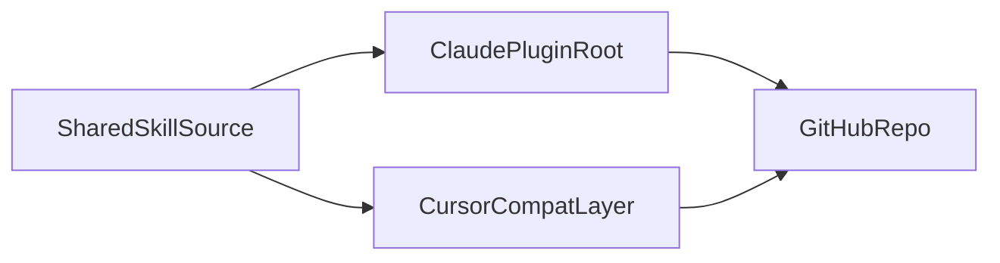

# OpenCat GitHub Plugin Packaging Plan

## 目标

把现有 3 个技能从项目内私有目录整理成一个可公开发布的 GitHub 仓库，并提供两个清晰入口：

- `Claude Code`：作为 namespaced plugin 安装，这是第一优先级
- `Cursor`：作为兼容 skills 包安装，不额外引入 MCP 或 marketplace 复杂度

现有技能源文件：

- `[f:/okzkx/feishu_docs_sync/.claude/skills/opencat-check/SKILL.md](f:/okzkx/feishu_docs_sync/.claude/skills/opencat-check/SKILL.md)`
- `[f:/okzkx/feishu_docs_sync/.claude/skills/opencat-task/SKILL.md](f:/okzkx/feishu_docs_sync/.claude/skills/opencat-task/SKILL.md)`
- `[f:/okzkx/feishu_docs_sync/.claude/skills/opencat-work/SKILL.md](f:/okzkx/feishu_docs_sync/.claude/skills/opencat-work/SKILL.md)`

需要在仓库和技能说明里明确：`opencat-task` / `opencat-work` 依赖外部 OpenSpec 技能，不随首个发布包一起分发。

```302:306:f:/okzkx/feishu_docs_sync/.claude/skills/opencat-task/SKILL.md
## Windows PowerShell 注意事项

- 不使用 bash heredoc `$(cat <<'EOF' ...)`
- 使用 PowerShell here-string 或多个 `-m` 参数
- 不用 `&&` 链接命令，用分步或 `$LASTEXITCODE`
```

```74:76:f:/okzkx/feishu_docs_sync/.claude/skills/opencat-task/SKILL.md
#### 3. Purpose 阶段（主 worktree）

**在主 worktree 中**调用 `openspec-propose` skill。
```

## 策略调整

优先做“一个主仓库 + 一层兼容”的 MVP，而不是一开始维护两套完整发布物：

- 以 `Claude Code plugin` 目录结构作为仓库主结构
- 参考本机已安装的官方插件，例如 `example-plugin` 与 `plugin-dev`
- 仅为 `Cursor` 增加一个轻量兼容层，避免首版就引入复杂构建链
- 暂不把 `OpenSpec` 技能打包进来，只把它们声明为 prerequisite

## 推荐结构

采用“Claude plugin 为主，Cursor 兼容为辅”的仓库结构。




建议新仓库结构：

- `.claude-plugin/plugin.json`
- `skills/opencat-check/SKILL.md`
- `skills/opencat-task/SKILL.md`
- `skills/opencat-work/SKILL.md`
- `.cursor/skills/` 或 `.agents/skills/`：Cursor 兼容层
- `references/`：放依赖说明、兼容矩阵、迁移说明
- `scripts/`：放同步/校验脚本，仅在确有必要时添加
- `README.md`：统一安装说明
- `LICENSE`

建议直接采用下面这个仓库树，避免后续继续讨论布局：

```text
opencat-workflows/
├── .claude-plugin/
│   └── plugin.json
├── skills/
│   ├── opencat-check/
│   │   ├── SKILL.md
│   │   └── references/
│   │       └── prerequisites.md
│   ├── opencat-task/
│   │   ├── SKILL.md
│   │   └── references/
│   │       ├── dependency-openspec.md
│   │       └── workflow-stages.md
│   └── opencat-work/
│       ├── SKILL.md
│       └── references/
│           └── todo-conventions.md
├── .cursor/
│   └── skills/
│       ├── opencat-check/
│       │   └── SKILL.md
│       ├── opencat-task/
│       │   └── SKILL.md
│       └── opencat-work/
│           └── SKILL.md
├── references/
│   ├── install-claude-code.md
│   ├── install-cursor.md
│   └── compatibility-matrix.md
├── scripts/
│   └── sync-cursor-skills.ps1
├── README.md
└── LICENSE
```

这个布局的意图：

- `skills/` 是唯一主数据源，服务 Claude Code plugin
- `.cursor/skills/` 是兼容镜像，必要时由脚本同步生成
- 技能自己的 `references/` 放深度说明，避免 `SKILL.md` 过长
- 仓库根的 `references/` 只放安装和兼容文档

## 命名与发布约定

建议固定以下名字，避免后续反复改名：

- GitHub 仓库名：`opencat-workflows`
- Claude Code plugin name：`opencat-workflows`
- Claude Code 技能调用形式：`/opencat-workflows:opencat-check`
- Cursor 技能名：`opencat-check`、`opencat-task`、`opencat-work`
- 首个版本号：`0.1.0`

命名原则：

- 仓库名、plugin 名、命名空间保持一致
- 不把 `openspec` 放进插件名，因为它只是外部依赖，不是本包主体
- 不使用过宽泛的 `opencat-plugin`，避免未来包内增加 agents / hooks 时语义过窄

## plugin.json 草稿

建议直接按这个最小可发布版本起步：

```json
{
  "name": "opencat-workflows",
  "version": "0.1.0",
  "description": "OpenCat workflow skills for repository task execution, OpenSpec-driven change delivery, and prerequisite checking.",
  "author": {
    "name": "opencat"
  },
  "license": "MIT",
  "homepage": "https://github.com/<owner>/opencat-workflows",
  "repository": "https://github.com/<owner>/opencat-workflows",
  "keywords": ["claude-code", "cursor", "skills", "openspec", "workflow", "git-worktree"]
}
```

字段优先级：

- 必须有：`name`
- 第一版建议有：`version`、`description`、`author`、`license`
- 仓库公开后补上：`homepage`、`repository`、`keywords`

## 三个技能的改造清单

### `opencat-check`

保留内容：

- 环境检查顺序
- 缺失依赖时的修复策略
- “验证后再继续”的护栏

需要改写：

- 把“当前仓库默认 npm”改成更通用的“按 lockfile 推断包管理器”
- 把本地具体安装习惯改成通用描述
- 明确这是“前置环境检查技能”，可独立使用

发布后预期定位：

- 最适合作为安装后第一个显式调用的技能

### `opencat-task`

保留内容：

- purpose → apply → archive 的阶段式流程
- worktree 保留、不删目录
- rebase 优先、冲突默认自解

需要改写：

- 明确声明依赖外部 `openspec-propose`、`openspec-apply-change`、`openspec-archive-change`
- 把当前仓库中的默认分支、路径、工作树命名写成“推荐约定”，不是强绑定
- 把 PowerShell 约束保留为跨平台注意事项的一部分

发布后预期定位：

- 这是插件的核心技能，README 要重点展示它

### `opencat-work`

保留内容：

- `TODO.md` / `DONE.md` 驱动的连续执行思路
- 优先级选择规则
- 主 Agent 编排、SubAgent 执行的职责划分

需要改写：

- 把 `TODO.md` 格式约定写进 `references/todo-conventions.md`
- 明确说明这是“约定优于配置”的工作流技能，不适合任意任务板格式
- 明确依赖 `opencat-task` 可用

发布后预期定位：

- 作为面向重度用户的高级技能，不是安装后第一入口

## README 需要直接回答的问题

README 不能只讲安装，必须直接回答用户最关心的 6 个问题：

1. 这是什么
2. 适用于谁
3. Claude Code 怎么安装
4. Cursor 怎么安装
5. OpenSpec 依赖怎么准备
6. 为什么技能加载了但执行不完整

建议 README 目录：

- Overview
- Included Skills
- Prerequisites
- Install in Claude Code
- Install in Cursor
- Usage Examples
- OpenSpec Dependency
- Troubleshooting
- Compatibility Notes

## 验证步骤固定化

执行时不要临场发挥，按固定顺序验证：

1. 检查 `plugin.json` 可被 Claude Code 验证通过
2. 用 `claude --plugin-dir <repo>` 加载本地插件
3. 在 Claude 中确认能看到 namespaced skills
4. 在 Cursor 中确认能看到 3 个 skills
5. 抽查 `README` 中每个安装命令与实际路径一致

如果第一版时间有限，验证优先级按下面排序：

- P0：Claude Code plugin 加载成功
- P1：Cursor 能识别 skills
- P2：同步脚本自动化

## 建议里程碑

把实施过程收敛为 3 个可提交里程碑：

### Milestone 1: 骨架可加载

- 建好仓库树
- 写出 `plugin.json`
- 迁入 3 个技能原稿
- Claude Code 可本地加载

### Milestone 2: 技能可公开理解

- 补齐 3 个技能的公开版描述
- 加入依赖说明和 references
- README 初版完成

### Milestone 3: Cursor 兼容可安装

- 补 `.cursor/skills/` 兼容层或生成脚本
- 完成 Cursor 安装验证
- 准备 `v0.1.0` 发布说明

## 分阶段实施

### Phase 1: 对标现成插件

- 先对照你本机已安装的 Claude 官方插件，确认最小骨架、命名和文档风格。
- 重点参考：
- `example-plugin`：最小可发布结构
- `plugin-dev`：复杂技能的目录组织和 `references/` 用法

交付结果：

- 一份最终仓库骨架草图
- 一份 `plugin.json` 字段清单
- 一份最终命名决定：仓库名、plugin 名、skills 命名空间

### Phase 2: 技能公共化整理

- 把 3 个技能文案做一次“公开发布版整理”。
- 统一 frontmatter 字段、命名风格、触发描述和依赖说明。
- 把只适用于当前仓库的细节拆成“默认约定”或“前置条件”，而不是硬编码成公共插件行为。

需要重点处理的耦合点：

- `TODO.md` / `DONE.md` 文件约定
- 当前仓库的分支策略和 worktree 命名
- OpenSpec 技能存在性
- Windows PowerShell 限制的公开说明方式

交付结果：

- 3 个公开版技能文案
- 一份依赖与适用边界说明
- 一份 `TODO.md` / `DONE.md` 格式说明

### Phase 3: Claude Code plugin 包装

- 创建 `.claude-plugin/plugin.json`
- 定义稳定命名空间，例如 `opencat-workflows`
- 约定最终技能调用形态，例如 `/opencat-workflows:opencat-task`
- 按官方插件结构组织 `skills/`、`references/`、可选 `scripts/`

交付结果：

- 可被 `claude --plugin-dir` 直接加载的插件目录
- 本地验证步骤清单
- 一个可直接放进仓库的 `plugin.json` 初稿

### Phase 4: Cursor 兼容包装

- 选择一种最轻量的 Cursor 兼容方式：
- 方案 A：在仓库中保留 `.cursor/skills/` 兼容镜像
- 方案 B：用脚本从 `skills/` 生成 `.cursor/skills/` 或 `.agents/skills/`

本阶段目标是“能安装并识别”，不是追求漂亮的构建系统。

交付结果：

- Cursor 兼容目录或生成脚本
- 一段明确的安装说明
- 一份“主结构和兼容镜像谁是 source of truth”的约定

### Phase 5: 文档与发布

- 在 `README.md` 中明确写出：
- 适用产品：Claude Code、Cursor
- 安装方式：Claude plugin / Cursor skills
- OpenSpec 前置依赖
- 常见失败场景与排障
- 推荐版本策略：先发 `v0.x`

## 验证清单

- Claude Code 能用 `claude --plugin-dir <repo>` 识别插件
- Claude Code 能看到 namespaced skills
- Cursor 能识别 `opencat-check`、`opencat-task`、`opencat-work`
- README 中的命令、路径、命名空间与实际目录一致
- 不依赖当前私有仓库路径也能理解技能用途
- OpenSpec 缺失时，文档和技能说明能明确提示前置条件

## 关键决策

- 先对标现成已安装插件，再决定目录细节，不自己发明结构。
- 仓库主结构优先服务 `Claude Code plugin`。
- `skills/` 是 source of truth，`.cursor/skills/` 是镜像，不反向编辑。
- `Cursor` 先做兼容层，不在首版做真正 plugin marketplace 或 MCP。
- OpenSpec 相关技能保持“外部前置依赖”，不打进首个发布包。
- 首版优先追求“可安装、可识别、可理解”，再考虑自动化生成和多平台增强。

## 首批产出物

- 一个公开 GitHub 仓库骨架
- 一个 `plugin.json` 初稿
- 3 个整理后的公开版技能
- 一个 Cursor 兼容方案（目录或脚本）
- 一套技能级 `references/` 文档
- 一份面向用户的安装与排障 README

## 验收标准

- 仓库 clone 后，Claude Code 可直接按 plugin 方式加载
- Cursor 至少有一条清晰可行的安装路径
- 3 个技能都能被发现，并具备公开可读的描述与依赖说明
- README 明确写出 OpenSpec 依赖、安装步骤和排障方式
- `skills/` 与 `.cursor/skills/` 的关系清晰，维护方式明确
- 不再依赖当前私有仓库路径、私有目录名或当前项目上下文才能理解或使用技能

