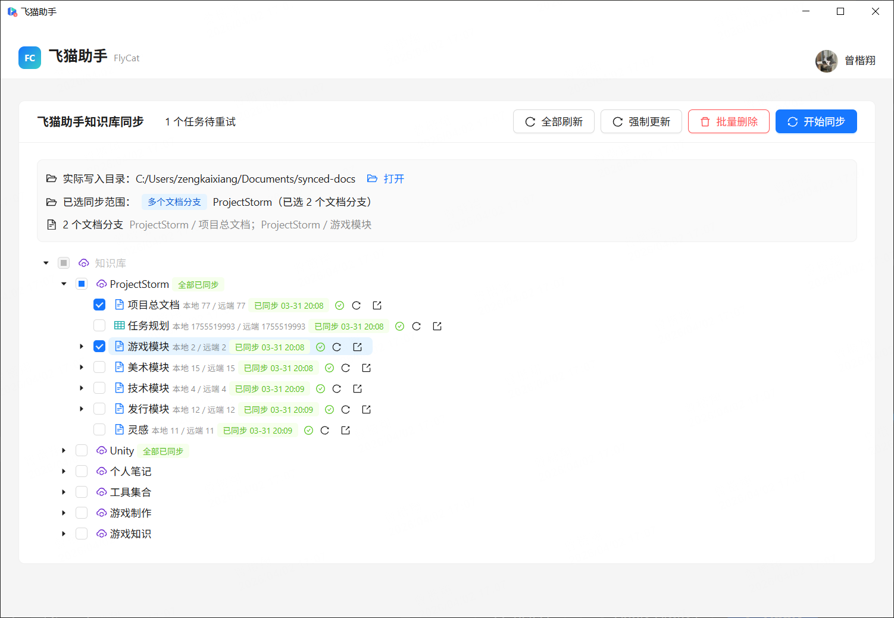

# 飞猫助手 (FlyCat)

> **仓库主导航文件**：[README.md](./README.md)。本文档为简体中文说明的集中排版，内容与 `README.md` 对齐，便于从默认 README 跳转阅读。

将飞书知识库文档同步到本地的 **Tauri + React** 桌面应用。适合需要在本地 Markdown、图片与导出文件中离线管理飞书知识库内容的团队与个人。

## 目录

- [功能亮点](#功能亮点)
- [界面与素材说明](#界面与素材说明)
- [使用流程](#使用流程)
- [快速开始](#快速开始)
  - [安装](#安装)
  - [使用](#使用)
- [技术栈](#技术栈)
- [开发指南](#开发指南)
  - [环境要求](#环境要求)
  - [安装依赖](#安装依赖)
  - [开发模式](#开发模式)
  - [OAuth 回调地址](#oauth-回调地址)
  - [构建](#构建)
  - [运行测试](#运行测试)
  - [类型检查](#类型检查)
- [OpenCat 工作流](#opencat-工作流)
  - [环境检查 opencat-check](#环境检查-opencat-check)
  - [主工作流 opencat-task](#主工作流-opencat-task)
  - [Git 策略](#git-策略)
  - [PowerShell 注意事项](#powershell-注意事项)
  - [致谢 opencat-workflows](#致谢-opencat-workflows)
- [项目结构](#项目结构)
- [许可证](#许可证)

## 功能亮点

- **飞书知识库同步** — 支持将飞书知识库文档同步为本地 Markdown
- **图片本地化** — 自动下载并本地化文档中的图片资源
- **增量同步** — 仅同步变更内容，提高效率
- **桌面应用** — 原生桌面体验，支持 Windows、macOS、Linux
- **实时状态** — 可视化同步进度与状态展示

## 界面与素材说明

当前仓库附带一张应用界面截图，展示知识库树、同步范围与批量操作区的实际样式：



若需体验完整交互流程，请在本地按下方 [开发模式](#开发模式) 或安装包启动应用后查看。

## 使用流程

1. 启动飞猫助手
2. 使用飞书账号完成登录授权
3. 在知识库树中选择要同步的范围
4. 设置本地同步目录
5. 开始同步并在工作区中查看输出的 Markdown / 导出文件

## 快速开始

### 安装

1. 在 [**Releases**](https://github.com/okzkx/fly-cat/releases) 页面下载对应平台的安装包  
2. 运行安装程序完成安装

### 使用

1. 启动飞猫助手  
2. 使用飞书账号登录授权  
3. 选择要同步的知识库范围  
4. 设置本地同步目录  
5. 点击开始同步  

## 技术栈

| 技术 | 版本 | 说明 |
|------|------|------|
| [Tauri](https://tauri.app/) | 2.x | 跨平台桌面应用框架 |
| [React](https://react.dev/) | 19 | 前端 UI 框架 |
| [TypeScript](https://www.typescriptlang.org/) | 5.x | 类型安全的 JavaScript |
| [Ant Design](https://ant.design/) | 6.x | React UI 组件库 |
| [Vite](https://vitejs.dev/) | 7.x | 前端构建工具 |
| [Rust](https://www.rust-lang.org/) | - | Tauri 后端语言 |

## 开发指南

### 环境要求

- Node.js 18+
- Rust（通过 [rustup](https://rustup.rs/) 安装）
- pnpm / npm / yarn

### 安装依赖

```bash
npm install
```

### 开发模式

```bash
npm run tauri dev
```

`npm run tauri dev` 会优先尝试 `localhost:1430`，若该端口已被占用，会自动回退到附近可用端口并让 Tauri 使用同一开发地址。

### OAuth 回调地址

在飞书开放平台应用中预先配置以下桌面 OAuth 回调地址：

- `http://localhost:3000/callback`
- `http://localhost:3001/callback`
- `http://localhost:3002/callback`
- `http://localhost:3003/callback`
- `http://localhost:3004/callback`
- `http://localhost:3005/callback`
- `http://localhost:3006/callback`
- `http://localhost:3007/callback`
- `http://localhost:3008/callback`
- `http://localhost:3009/callback`
- `http://localhost:3010/callback`

若授权页提示本地回调初始化失败，请检查上述 localhost 端口范围是否被其他应用占用。

### 构建

```bash
npm run tauri build
```

### 运行测试

```bash
npm run test
```

### 类型检查

```bash
npm run typecheck
```

## OpenCat 工作流

项目内置 OpenCat skill，用于在 OpenSpec 变更流里执行环境检查、分阶段实现、归档与 Git 集成。

### 环境检查 opencat-check

在开始 `opencat-task` 前，先运行 `opencat-check`。它负责：

- 检查 `git`、`node`、`npm`、`openspec`
- 必要时补装 OpenSpec CLI
- 检查仓库依赖是否已安装
- 确认当前环境是否可以继续执行 OpenCat 工作流

### 主工作流 opencat-task

`opencat-task` 是带 Git 检查点与可复用 worktree 的 OpenSpec 一体化流程，核心步骤如下：

1. 在主工程中完成 `purpose` 阶段（proposal / change 产物生成与校验）。
2. `purpose` 通过后创建 `opencat/<change-name>` 分支，并提交一次 `purpose commit`。
3. 在可复用的 linked worktree 中执行 `apply`，完成后提交 `apply commit`。
4. `archive` 前将工作分支 rebase 到最新主干，再执行归档与中文归档报告生成。
5. `archive` 完成后提交 `archive commit`（标题与正文可基于 `change-report.zh-CN.md` 摘要）。
6. 回到主工程将工作分支 `merge --no-ff` 回主干，删除任务分支，保留 linked worktree 供下次复用。

### Git 策略

- `purpose`、`apply`、`archive` 分别形成独立检查点提交  
- `apply` 之前不进入 worktree，避免 proposal 阶段过早切换隔离环境  
- `archive` 之前先同步并 rebase 到最新主干，减少最终合并偏差  
- 最终使用 `git merge --no-ff` 保留完整分支历史  
- 普通 rebase/merge 冲突由自动化流程优先处理；无法可靠判断时再人工介入  
- linked worktree 默认保留，不在每次任务结束时删除  

### PowerShell 注意事项

Windows PowerShell 下执行 Git 提交时，避免使用 bash 风格语法：

- 不要使用 `$(cat <<'EOF' ...)` 这类 heredoc 写法  
- 不要使用 `&&` 串联多条 Git 命令  
- 推荐使用 PowerShell here-string 或分步执行  

### 致谢 opencat-workflows

本文档所述 OpenCat 技能（`opencat-check`、`opencat-cleanup`、`opencat-task`、`opencat-work`）来自开源插件 **[opencat-workflows](https://github.com/okzkx/opencat-workflows)**。感谢上游维护者与社区贡献。

## 项目结构

```
feishu-docs-sync/
├── src/                    # 前端源码
│   ├── components/         # React 组件
│   ├── services/           # 服务层
│   ├── types/              # TypeScript 类型定义
│   ├── utils/              # 工具函数
│   └── App.tsx             # 主应用组件
├── src-tauri/              # Tauri 后端 (Rust)
│   ├── src/
│   │   ├── commands.rs     # Tauri 命令
│   │   ├── sync.rs         # 同步逻辑
│   │   └── lib.rs          # 入口
│   └── Cargo.toml          # Rust 依赖
├── tests/                  # 测试文件
├── openspec/               # 项目规范和变更管理
└── package.json            # Node.js 配置
```

## 许可证

MIT License
